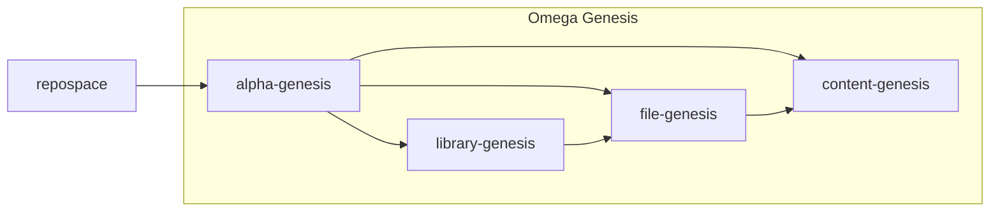
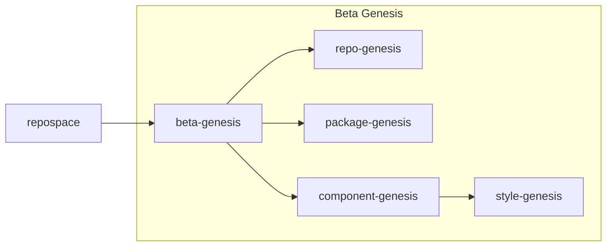
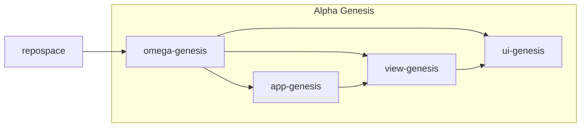

# Journey

> Brainstorm all the genesis things

---

## Genesis

---

* [Alpha](##Alpha-Genesis) = generate `raw files and raw libraries`
* [Beta](##Beta-Genesis) = generate `specialty libraries and files`
* [Omega](##Omega-Genesis) = generate `library groupings`

### Definitions

| Name                            | Examples                                |
| :------------------------------ | :-------------------------------------- |
| `raw files and raw libraries`   | files w/ content & libraries with files |
| `specialty libraries and files` | UI libraries, Config files              |
| `library groupings`             | Apps, Microservices                     |

### Purpose

The purpose of the genesis packages are to provide easy-access to related sets of modules. Sections below will detail how packages flow together and intended hierarchy.

### Naming

* `ALPHA`: Highest level abstraction (ie. file generation) is _most_ powerful and _least_ useful
* `BETA`: Moderately specific means _moderately_ powerful and _moderately_ useful
* `OMEGA`: Most specific implementation is _least_ powerful and _most_ useful

---

## Alpha Genesis

---

> In studies of social animals, the highest ranking individual is sometimes designated as the alpha. Males, females, or both, can be alphas, depending on the species. Where one male and one female fulfill this role together, they are sometimes referred to as the alpha pair. Other animals in the same social group may exhibit deference or other species-specific subordinate behaviours towards the alpha or alphas.

---

## Beta Genesis

---

> Beta animals often act as second-in-command to the reigning alpha or alphas and will act as new alpha animals if an alpha dies or is otherwise no longer considered an alpha. In some species of birds, males pair up in twos when courting, the beta male aiding the alpha male. It has been found that the social context of the animals has a significant impact on courtship behavior and the overall reproductive success of that animal.

---

## Omega Genesis

---

> Omega (usually rendered ω) is an antonym used to refer to the lowest caste of the hierarchical society. Omega animals are subordinate to all others in the community, and are expected by others in the group to remain submissive to everyone. Omega animals may also be used as communal scapegoats or outlets for frustration, or given the lowest priority when distributing food.[3]

