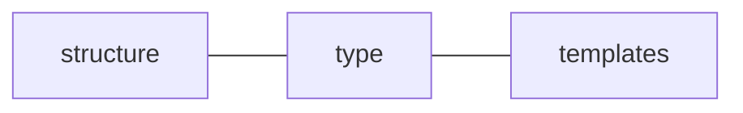

# Library Genesis

> The purpose of library-genesis is to make it easy to convert a single config into a scaffolded project. This is more fluid than cloning.

---

## Brainstorm

---

### Dependencies


### Config File



* `Structure`
  > How everything is laid out
* `Type` (ie. directory, plain, symlink, template)
  > Will symlinking present any race case issues ?
* `Templates`
  > Files which are being duplicated with interpolated values

---

### Questions

---

**Structure**

* This is the essence of the config. This structure itself should be fairly straightforward.
* What's the best way to reference templates (templatePath, templateVariables)?

**Type**

* How should types be specified?
  * Directories are self-evident. `Directory/`

**Templates**

* _Q:_ How should they be `defined`? (A: see content-genesis for reference)
* _Q:_ Where should they be `stored`?
* _Q:_ How should they be `shared`?
* _Q:_ How should they be `classified`?

---

### Config Playground

---

**Options**

* [Copying](#copying) format of existing project
* [Creating](#creating) new format from scratch

#### Copying

**Bash Input**

`ls >> file.log`

**Output**
file.log

```
templates
yarn.lock
docs
index.js
src
README.md
tests
package.json
node_modules
```

**Node Implementation**

1. yarn add [shelljs](https://www.npmjs.com/package/shelljs)
2. implement shelljs
3. Parse each file by type

[Code Example](https://www.npmjs.com/package/shelljs#examples)

```js
// Replace macros in each .js file
shell.cd("lib");
shell.ls("*.js").forEach(function(file) {
  shell.sed("-i", "BUILD_VERSION", "v0.1.2", file);
  shell.sed("-i", /^.*REMOVE_THIS_LINE.*$/, "", file);
  shell.sed("-i", /.*REPLACE_LINE_WITH_MACRO.*\n/, shell.cat("macro.js"), file);
});
```

---

#### Creating

> Config format from scratch which takes in raw config to generate everything...

**Topology**

* Directories
* Files
  * Templates
    * Content Variables
  * Configurations
    * Package
      * Dependencies

**Sample**

```js
let libray = {
  directory: [
    { file.ext: { t: "/path/to/template.js", v: {Foo: "Bar"}}},
    { file.ext: { c: "Foobar"}},
    { file.ext: { s: "/path/to/file/to/symlink"}},
    directory: [
      { file.ext: { c: "Foobar"}},
      { file.ext: { c: "Foobar"}},
      { file.ext: { c: "Foobar"}},
    ];
  ];
};
```

**File & Directory Attributes**

| Name      | Type   | Attributes                                    |
| :-------- | :----- | :-------------------------------------------- |
| file      | object | `filename.extension`, nested                  |
| directory | array  | `directoryname`, parent of other files & dirs |

**Flags**

* `t` = template : string (path)
* `v` = variables : object
* `c` = content : string
* `s` = symlink : string (path)
