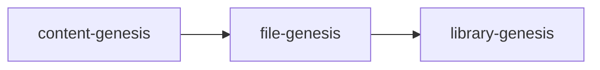
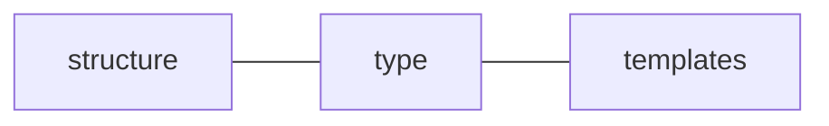

# Library Genesis

> The purpose of library-genesis is to make it easy to convert a single config into a scaffolded project. This is more fluid than cloning.

---

## Brainstorm

---

### Dependencies



### Config File



* `Structure`
  > How everything is laid out
* `Type` (ie. directory, plain, symlink, template)
  > Will symlinking present any race case issues ?
* `Templates`
  > Files which are being duplicated with interpolated values

---

### Questions

---

**Structure**

* This is the essence of the config. This structure itself should be fairly straightforward.
* What's the best way to reference templates (templatePath, templateVariables)?

**Type**

* How should types be specified?
  * Directories are self-evident. `Directory/`

**Templates**

* _Q:_ How should they be `defined`? (A: see content-genesis for reference)
* _Q:_ Where should they be `stored`?
* _Q:_ How should they be `shared`?
* _Q:_ How should they be `classified`?

### Config Playground

Config paths:

* Copying format of existing project
* Creating new format from scratch

#### Copying

**Bash Input**

`ls >> file.log`

**Output**
`file.log`

```
templates
yarn.lock
docs
index.js
src
README.md
tests
package.json
node_modules
```

**Node Input**

1. yarn add [shelljs](https://www.npmjs.com/package/shelljs)
2. [Code Example](https://www.npmjs.com/package/shelljs#examples)

```js
// Replace macros in each .js file
shell.cd("lib");
shell.ls("*.js").forEach(function(file) {
  shell.sed("-i", "BUILD_VERSION", "v0.1.2", file);
  shell.sed("-i", /^.*REMOVE_THIS_LINE.*$/, "", file);
  shell.sed("-i", /.*REPLACE_LINE_WITH_MACRO.*\n/, shell.cat("macro.js"), file);
});
```
