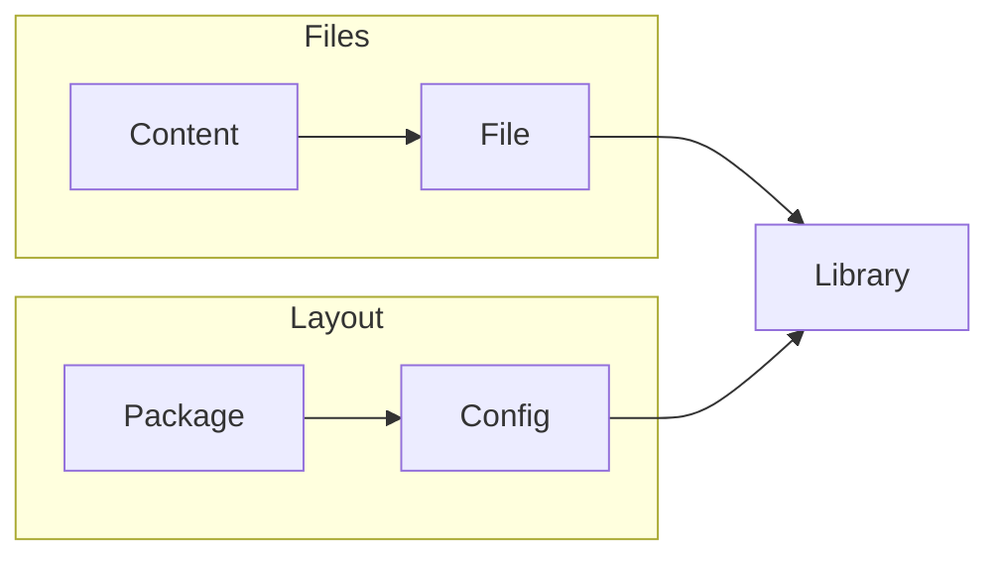
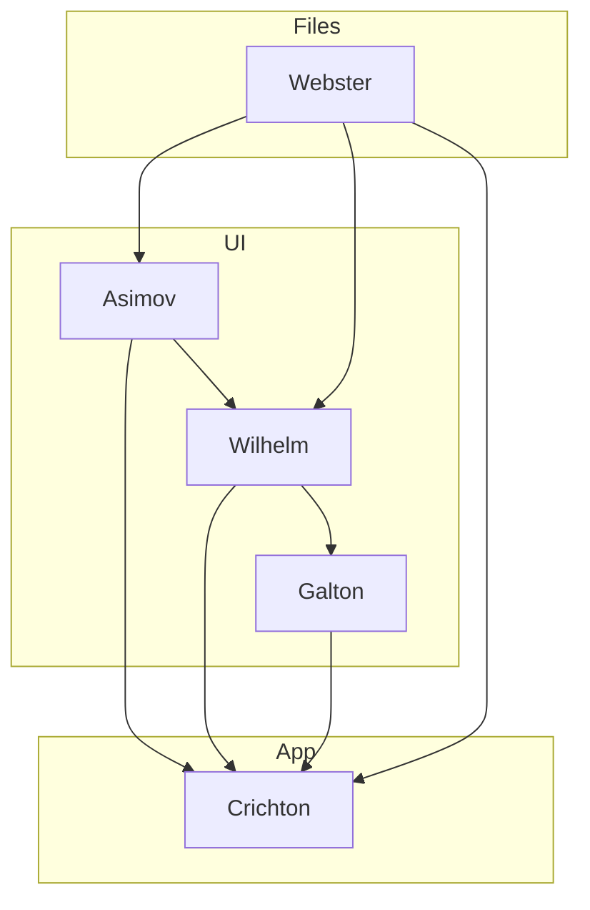

# Genesis

<!-- TOC START min:1 max:4 link:true update:false -->

* [Genesis](#genesis)
  * [Order of Precedent](#order-of-precedent)
    * [Module Creation](#module-creation)
      * [Bits](#bits)
      * [Wrigley](#wrigley)
    * [Chained Calls](#chained-calls)

<!-- TOC END -->

**Objectives**

> 1. Group all Genesis projects through [this repo](github.com/servexyz/genesis)
> 2. Define goals for each Genesis module
> 3. Outline API's centrally to ensure interoperability isn't lost through modularization

## Order of Precedent

> What occurs first ? In what context?

### Module Creation

1. Repospace

##### Bits

2. file-genesis
3. content-genesis
4. config-genesis
5. package-genesis
6. library-genesis

##### Wrigley

7. Asimov
8. Wilhelm
9. Galton
10. Webster
11. Crichton

> TODO: The graph below is a first-draft. Definitely could be optimized. Consult Wrigley docs and brainstorm.

