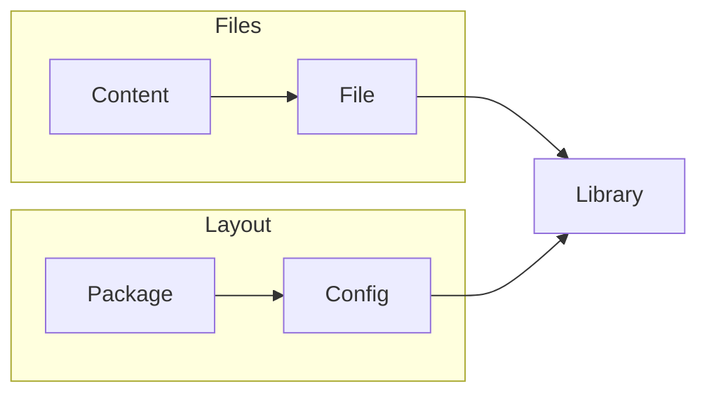
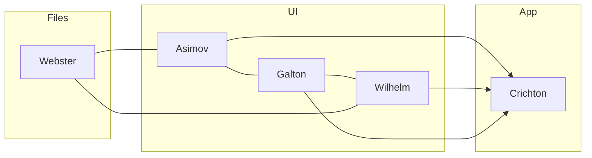

# Genesis

<!-- TOC START min:1 max:4 link:true update:false -->

* [Genesis](#genesis)
  * [Order of Precedent](#order-of-precedent)
    * [Module Creation](#module-creation)
      * [Bits](#bits)
      * [Wrigley](#wrigley)
    * [Chained Calls](#chained-calls)

<!-- TOC END -->

**Objectives**

> 1. Group all Genesis projects through [this repo](github.com/servexyz/genesis)
> 2. Define goals for each Genesis module
> 3. Outline API's centrally to ensure interoperability isn't lost through modularization

## Order of Precedent

> What occurs first ? In what context?

### Module Creation

* [x] Repospace

##### Bits

* [ ] _file_-genesis
* [ ] _content_-genesis
* [ ] _config_-genesis
* [ ] _package_-genesis
* [ ] _library_-genesis

##### Wrigley

* [ ] Asimov
* [ ] Wilhelm
* [ ] Galton
* [ ] Webster
* [ ] Crichton

